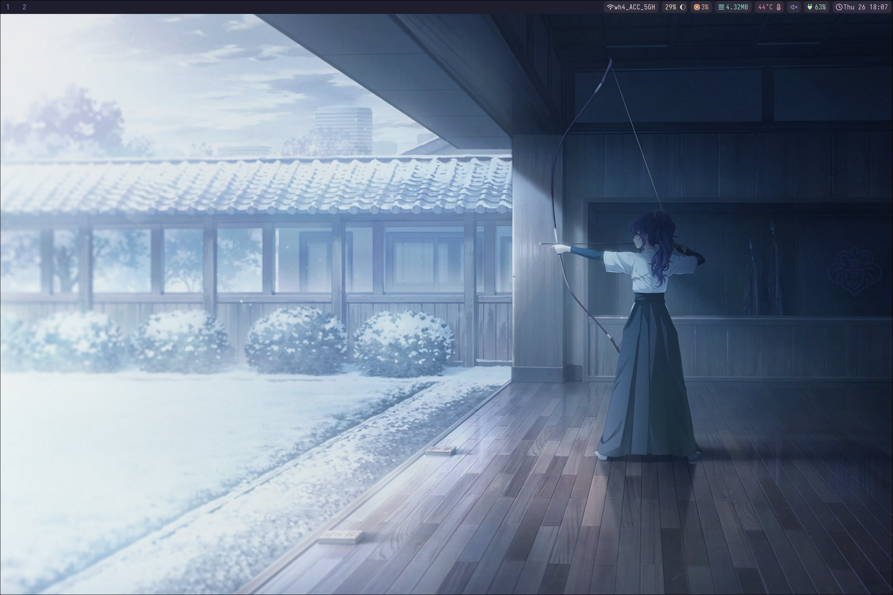
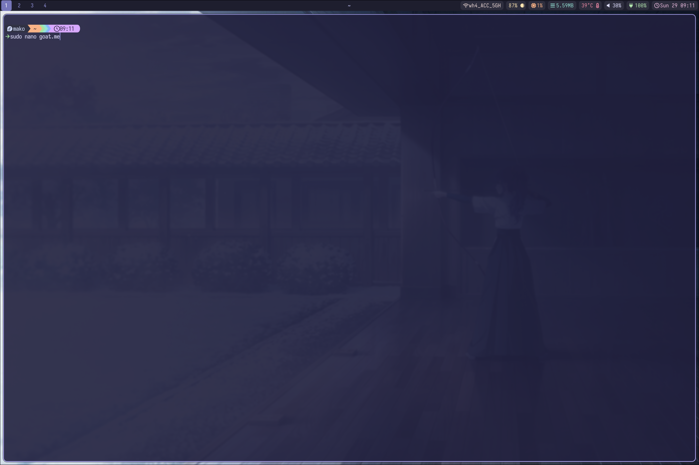
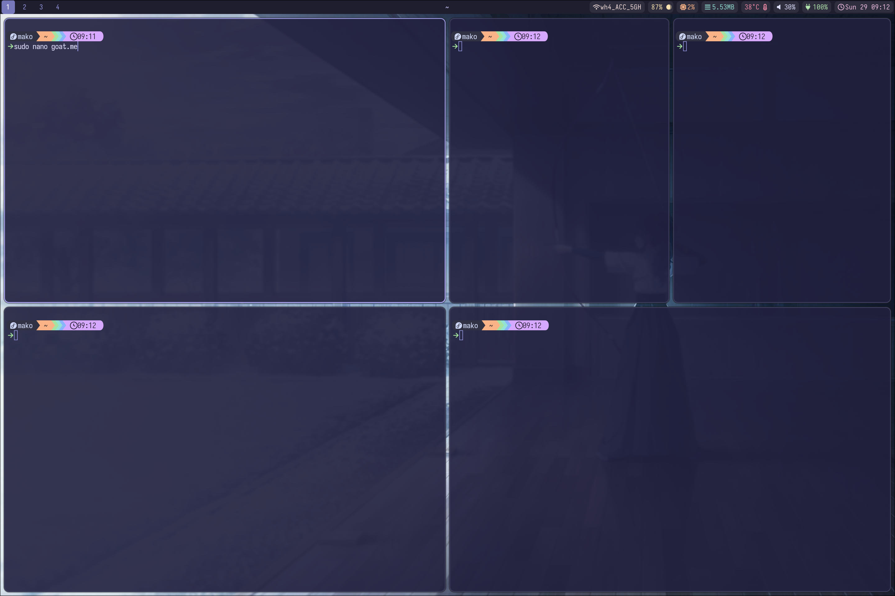
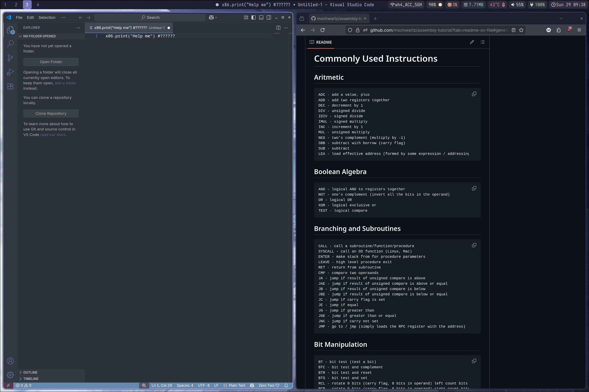
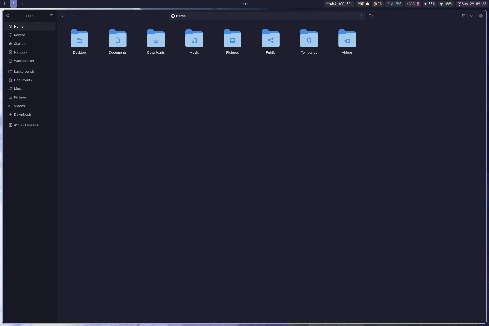
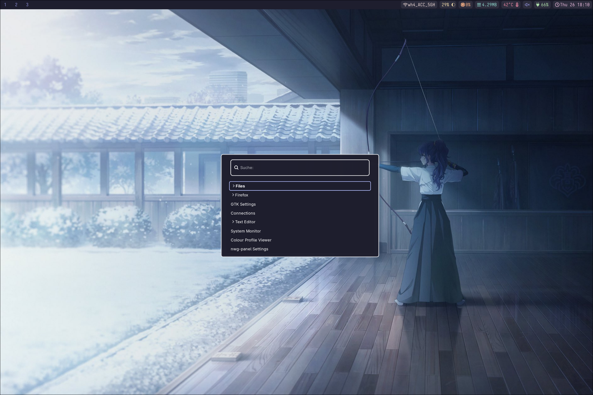

# My dotfiles :)

I'm just showing what I did for my fist try in Linux ricing. For my theme, I chose Mafuyu Asahina from Project Sekai.
It is FAR from perfect - at least that's what I think. I still don't really get some things - but we moving!

  
<h2>Screenshots</h2> <h6>so you can admire my work</h6>

  <h3>The desktop with Waybar and notification</h3>
  

  <h3>Terminal with custom colors and font</h3>
  

  <h3>Showcasing the tiling windowmanager</h3>
  

  <h3>Usage example</h3>
  

  <h3>Files</h3><h6>(i still have to change the folder colors)</h6>
  

  <h3>The menu program Wofi</h3>
  

Call me asian, the way I have so much rice!

